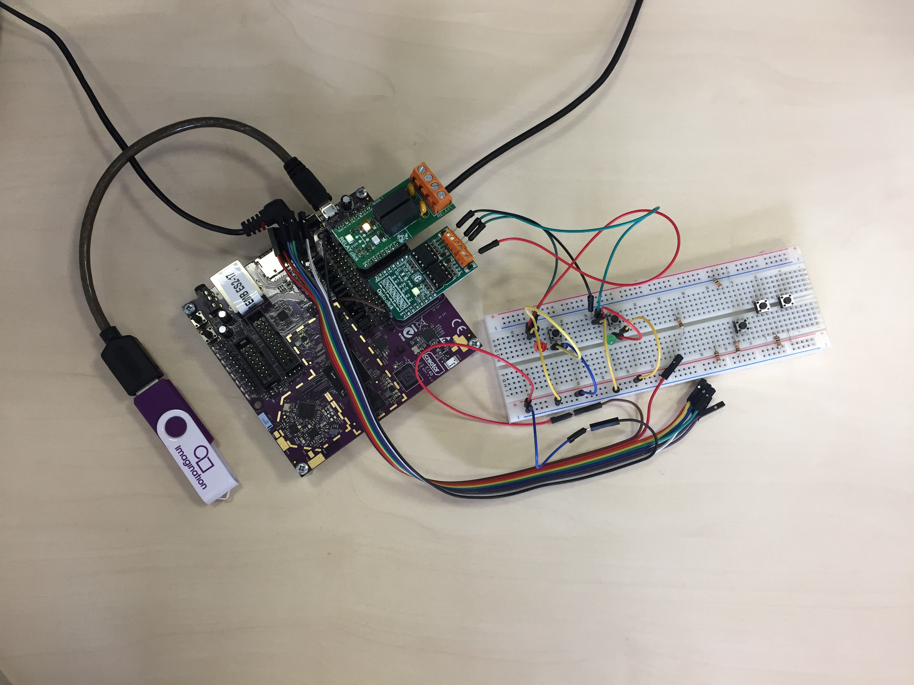

# Sesame gateway application

## Overview
Sesame gateway is a garage door controller application that runs on Ci40 board with Relay Click and Opto Click inserted in click interfaces. It acts as AwaL2MWM client and connects to **Creator Device Server**.

Sesame has been written to interface with a Cardale Autoglide MkIII motorised garage door opener. The Sesame project includes 

* [a java based web application](https://github.com/CreatorDev/webapp-sesame)
* [an android app for mobile devices](https://github.com/CreatorDev/android-sesame)
* [a simulator of the Autoglide MkIII functionality](https://github.com/CreatorDev/ci40-sesame-door-simulator) to allow the system to be tested with a Ci40 board and a stripped out CD-Rom drive.

A video of the Sesame system with integration to IFTTT and Amazon Alexa is on the [CreatorDev youtube channel](https://www.youtube.com/watch?v=cXrg5ei1hVM).

---

The device server is a LWM2M management server designed to be implemented alongside third party cloud services to integrate M2M capability into an IoT application. The device server exposes two secure interfaces; REST API/HTTPs and LWM2M/CoAP.

Sesame gateway application defines custom IPSO object 13201 to handle door functionality. It also defines two instances of IPSO 3200 object to monitor opened/closed sensors and sends notifications when the status changes.

Sesame gateway application serves the purpose of:
- It acts as Awalwm2m client
- It communicates with device server

Definition of resources: 

| Object Name       | Object ID | Resource Name       | Resource ID | Access Type | Type    |
| :-----------------| :---------| :-------------------| :-----------| :-----------| :-------|
| GarageDoor        | 13201     | DoorTrigger         | 5523        | Execute     | None    |
| GarageDoor        | 13201     | DoorCounter         | 5501        | Read        | Integer |
| GarageDoor        | 13201     | DoorCounterReset    | 5505        | Execute     | None    |
| GarageDoor        | 13201     | DoorDuration        | 5521        | Read        | Float   |
| OptoClick         | 3200      | Digital Input State | 5500        | Read        | Boolean |

Resources used for specific object instances:

| Object ID       | Instance | Name         | Trigger     | Counter | Counter Reset | Duration |
| :---------------| :--------| :------------| :-----------| :-------| :-------------| :--------|
| 13201           | 0        | Door Open    | -           | 5501    | 5505          | 5521     |
| 13201           | 1        | Door Close   | -           | 5501    | 5505          | 5521     |
| 13201           | 2        | Door Trigger | 5523        | 5501    | 5505          | -        |

| Object ID       | Instance | Name          | Digital Input State |
| :---------------| :--------| :-------------| :-------------------|
| 3200            | 0        | Opened Sensor | 5500                |
| 3200            | 1        | Closed Sensor | 5500                |


## Prerequisites
### Hardware
Relay Click should be inserted on Ci40 in Mikrobus Slot 1 and Opto click should be inserted in Slot 2. Below is the image of clicks connected to Ci40 board:


### App provisioning
App connects to **awa_clientd** running on board through IPC. Awa client needs to be provisioned to device server first. Provisioning can be done using LuCI interface. For this 
[Onboarding Scripts](https://github.com/CreatorDev/ci40-onboarding-scripts) package need to be installed on board.

## Using OpenWrt SDK to build standalone package

Please refer to [Ci40-HelloWorld](https://github.com/CreatorDev/Ci40_helloworld) project for exact build instructions.


## Running Application on Ci40 board
Sesame gateway application can be started from the command line as:

$ sesame_gateway_appd

Output looks something similar to this :

Sesame Gateway Application
```
Sesame Gateway Application ...

------------------------

Waiting for execute command on paths:

- 13201/2/5523

- 13201/0/5505

- 13201/1/5505

Observing Opto Clicks state

Door-Closed state change to 1

Door-Opened state change to 2

```

To have the sesame gateway application autostart when the Ci40 board boots it must be scheduled to execute after the awa client application has registered the board to the Creator device server. The OpenWrt distribution on the Ci40 allows for startup applications to be ordered at bootup using the init.d and rc.d functionality. These steps rely on the Ci40 board being provisioned to a Creator Device server account already, and that the sesame gateway appd application is already installed on the Ci40 board.

1. Create a script to call the sesame gateway application on your Ci40 in the /etc/init.d directory. A suitable script is available in the scripts directory of this repository that can be copied to etc/init.d. The script uses the START=99 priority index, the awa client startup executes at priority 98 in the boot process therefore the sesame gateway application will be started directly afterwards.
2. Make the startup script executable using chmod a+x start_sesame
3. Enable the startup script to be included in the boot process using /etc/init.d/start_sesame enable

----

## Contributing

We welcome all contributions to this project and we give credit where it's due. Anything from enhancing functionality to improving documentation and bug reporting - it's all good.

For more details about the Contributor's guidelines, refer to the [contributor guide](https://github.com/CreatorKit/creator-docs/blob/master/ContributorGuide.md).
